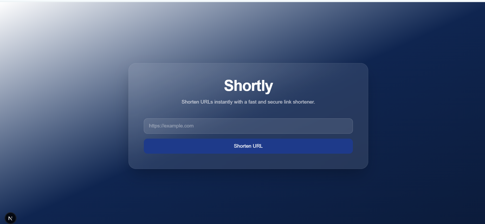

# URL Shortener

A modern, fast, and reliable URL shortening platform built with Next.js, Tailwind CSS, and MongoDB Atlas.

## Overview

This application allows users to convert long URLs into short, shareable links. It provides a clean user experience, fast redirects, and scalable data storage using MongoDB Atlas.

## Tech Stack
- Next.js
- Tailwind CSS
- MongoDB Atlas

## Reference

